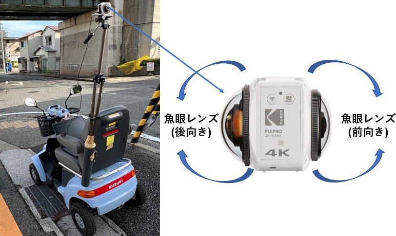
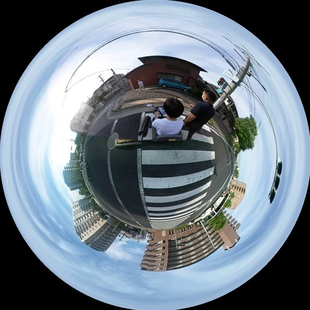
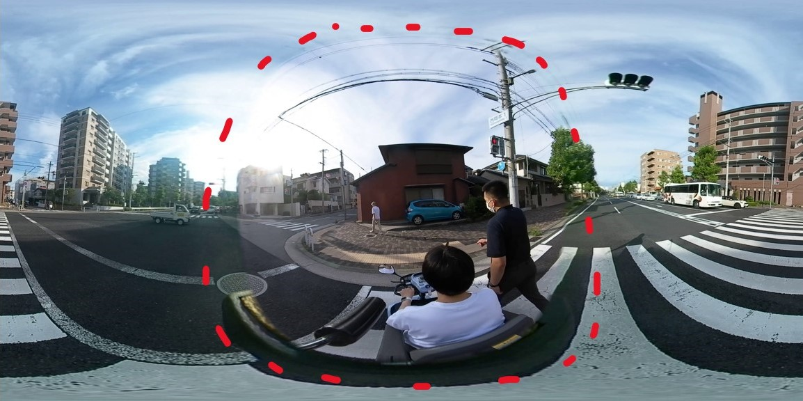
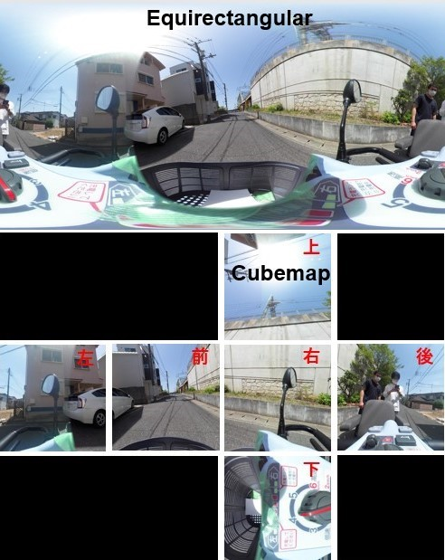
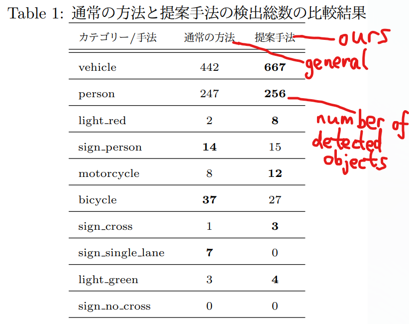
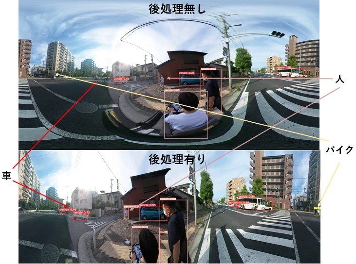
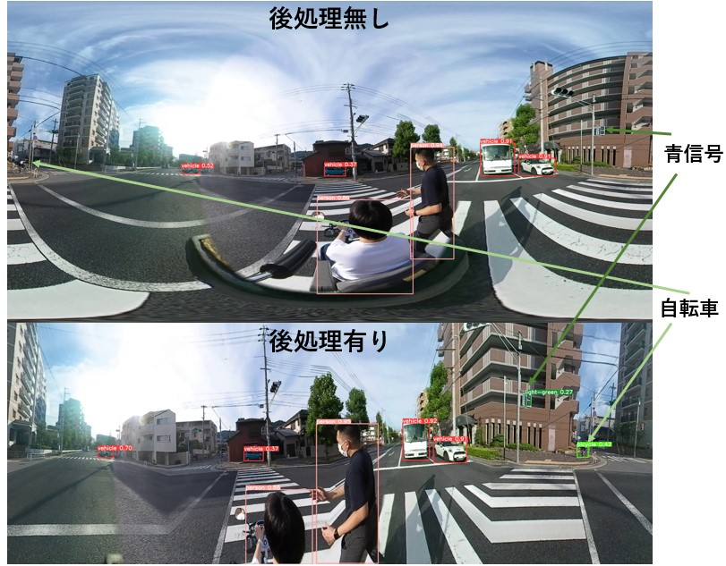

# ObjectDetectionViaOmnidirectionalCamera
This Japanese proceeding paper [Development of an Object Detection Method for Environmental Recognition at Streets by Using an Omnidirectional Camera / 全方位カメラを用いた物体検出による道路の環境認識](https://jglobal.jst.go.jp/detail?JGLOBAL_ID=202302261220995674) has been accpeted by SICE the 23th Conference of the System Integration Division / 第23回計測自動制御学会システムインテグレーション部門講演会 (SICE-SI 2022).

### Citation
```
B. Zhang / 張伯聞, M. Tanaka / 田中雅博, "Development of an Object Detection Method for Environmental Recognition at Streets by Using an Omnidirectional Camera / 全方位カメラを用いた物体検出による道路の環境認識," Proceedings of SICE the 23th Conference of the System Integration Division / 第23回計測自動制御学会システムインテグレーション部門講演会, pp. 3075-3078, 2022.
```

In this work, we focus on the street scene perception using an omnidirectional camera [KODAK PIXPR0 4KVR360 VR Camera](https://kodakpixpro.com/AsiaOceania/ph/cameras/vrcamera/4kvr360/) on the mobility scooter. 



The images encounter the distortion, small and separation problem caused by the fisheye of the camera. Thus, we aim to increase the recognition ability of object detection by using the Cubemap transformation and vertical extension. 

- 360 spherical to 360 equirectangular




- 360 equirectangular to 360 cubemap



- Here, we only use the four middle squares (front, back, left and right) and expand them 1.5 times vertically.

Through the experienmental results, it is shown that our proposed method is usefull to object detection.




# Usage
### Dependencies 
```
python=3.9 
pytorch>=1.7
torchvision
cudatoolkit=11.3
matplotlib>=3.2.2
numpy>=1.18.5
opencv-python>=4.1.2
Pillow>=7.1.2
PyYAML>=5.3.1
requests>=2.23.0
scipy>=1.4.1
tqdm>=4.41.0
labelImg
tensorboard>=2.4.1
pandas>=1.1.4
seaborn>=0.11.0
```

### Model
The object detection task is based on [YOLOv5](https://github.com/ultralytics/yolov5)
```
yolov5s.pt
```

### Datasets
We have created 200 datasets as follows. (only a few datasets are uploaded due to space issues on github)
```
data/master_zhang
```

### Train & valid
fine-tune
```
train.py
```

### Inference & results
Left: examples of general results (YOLOv5). Right: examples of our results (Processed + YOLOv5).




```
detect.py
0rename_multi_img_and_save_infe_resu.py
```


